# how-to-install-ld-player
how to install ld player

#### NOTE : abd work properly in SSD (ref: son_coder)

## PLS FOLLOW STEP BY STEP
+ Go to home page and download ldplayer

+ Select where to install and where to save LD player profile
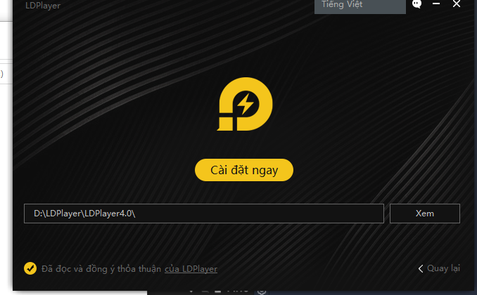

+ Change folder path and back
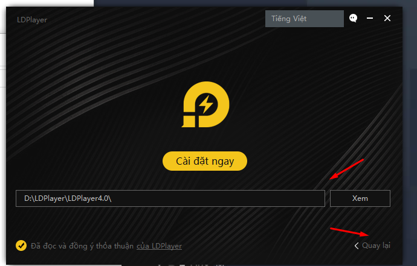

+ Click to install LD player
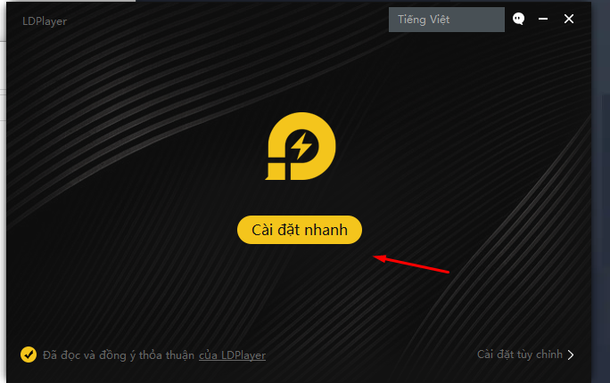

+ Decline install additional software
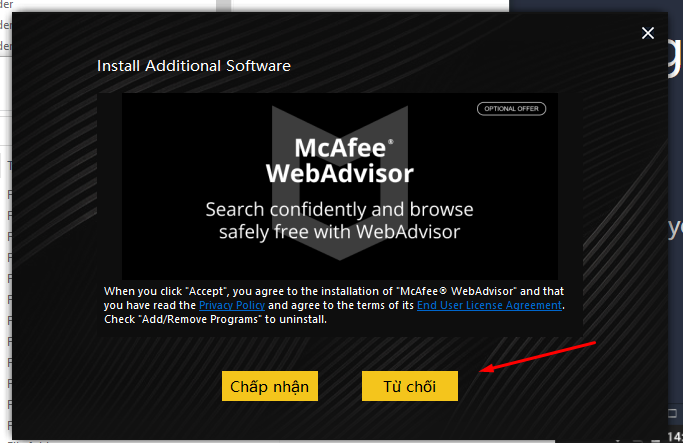

+ Run test LD player after insall successful
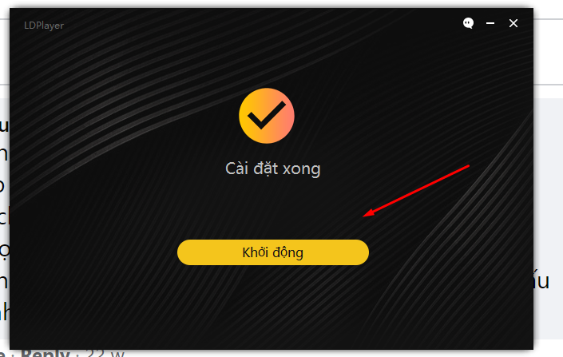

+ Close LD player
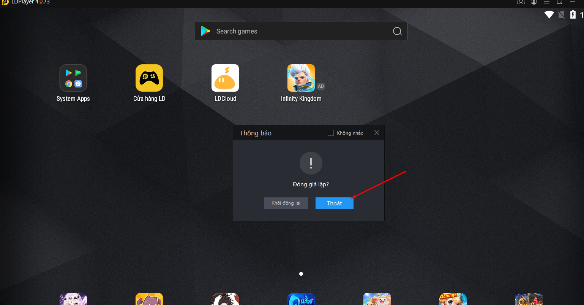

+ Go to desktop screen, click ldmulti and click step by step (Config screen revolution and ram, core ..)
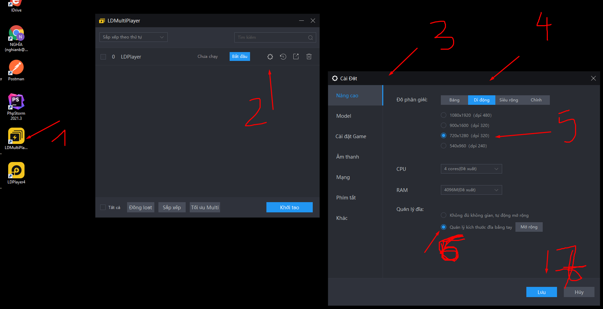

+ Remove all config for model
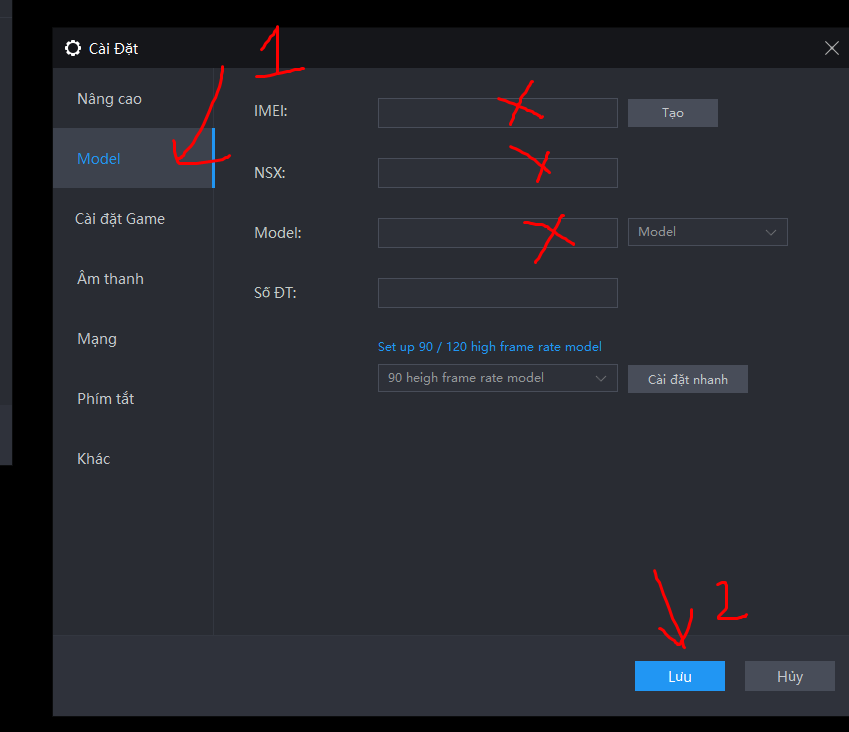

+ Other settings
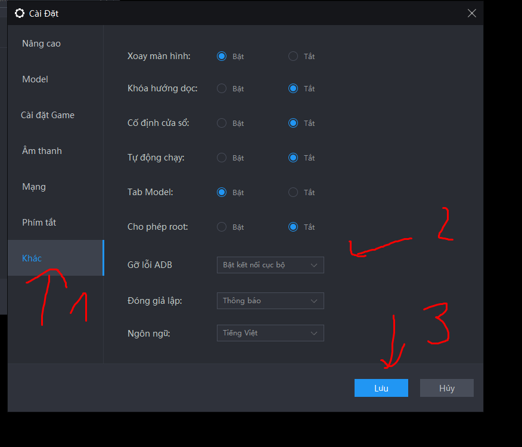

+ Start ld player 0
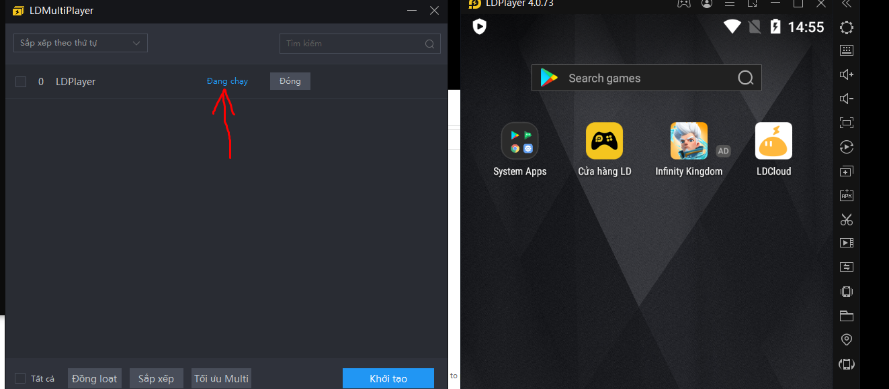

+ In ld player 0 => click setting
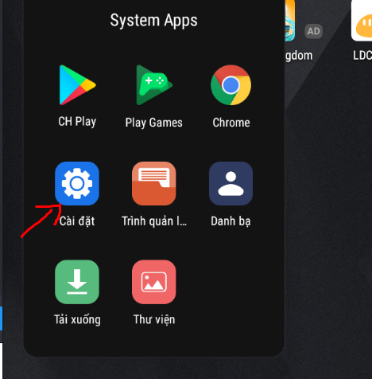

+ Enable adb
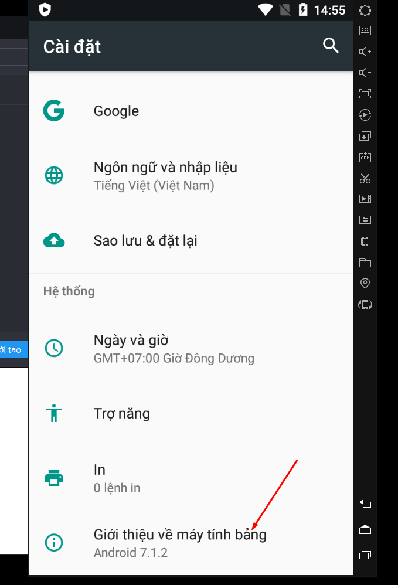
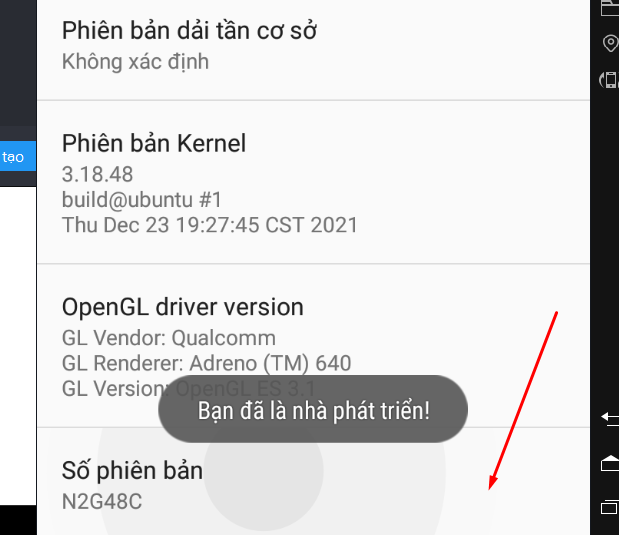
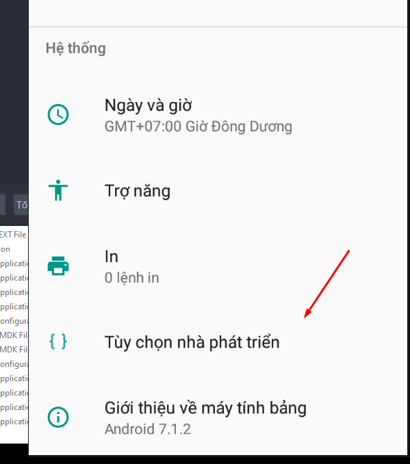
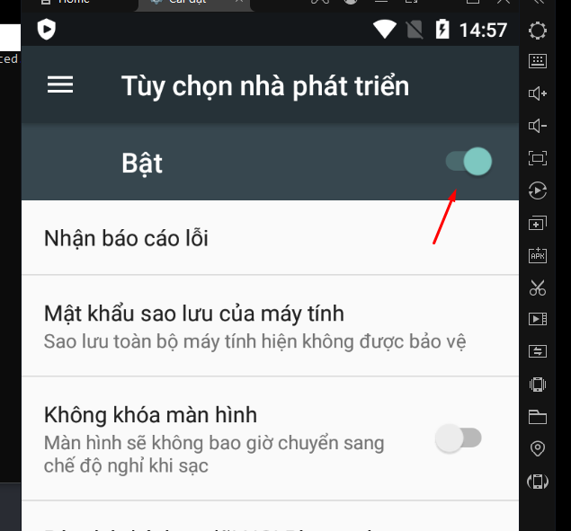

+ Test adb for ldplayer 0
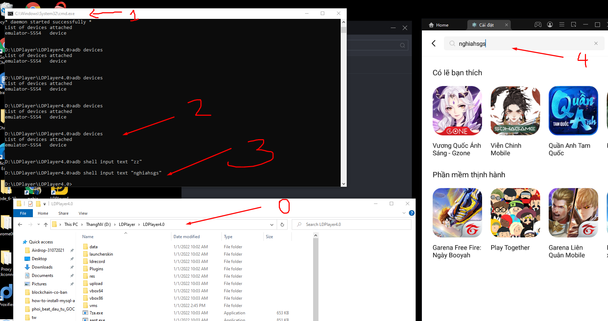

+ Clone abd 0 to many ld player
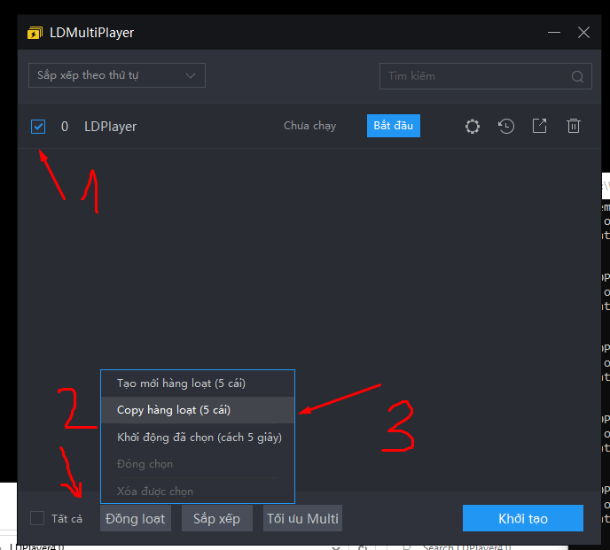

+ Test adb for many ldplayer
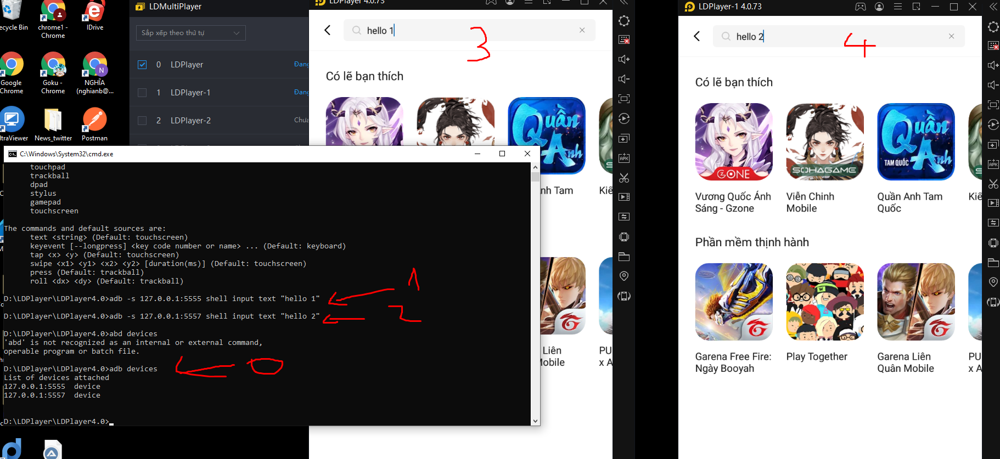

